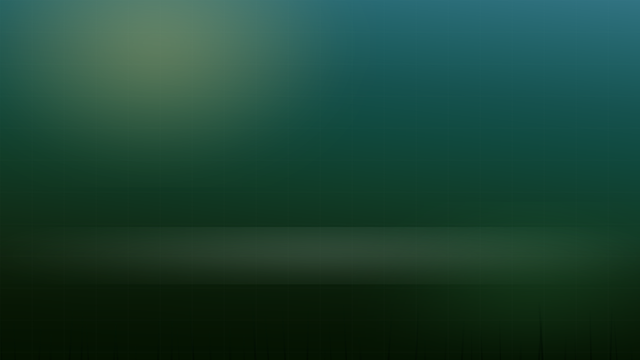

# naiture

A KDE Plasma 6 theme built from the *naiture* design canvas — an AI-first
desktop concept of teal dusk over a moss field, glass windows and floating
islands instead of a taskbar.

Built and tested on **Fedora 44, Plasma 6.6.4, Wayland**.



## What it changes

| Piece | What you get |
|---|---|
| Colour scheme | `Naiture` — near-black moss surfaces, sky-blue accent, moss/gold/ember semantics |
| Plasma theme | `naiture` — same palette for the shell, with background-contrast at the design's `saturate(170%)` |
| Wallpaper | Generated from the design's own gradient, glows, mist band and 44-blade grass field, at your screen's resolution |
| Panels | Floating, fit-to-content, 50px islands with adaptive translucency |
| Windows | Blur + background contrast on, borderless Breeze frames, very large soft shadows |
| Fonts | Archivo for the UI, JetBrains Mono for anything fixed-width |
| Konsole | `Naiture` profile and colour scheme, 82% opacity with blur |

## Install

```bash
git clone https://github.com/toladner/nAIture-os.git
cd naiture
./install.sh
```

The first run snapshots `kdeglobals`, `kwinrc`, `plasmarc`, `konsolerc`,
`breezerc` and the panel config into `~/.config/naiture/backup` before touching
anything. Re-running never overwrites that snapshot.

Applying the panel geometry restarts `plasmashell` — your windows are not
affected, the panel just blinks.

### Options

| Flag | Effect |
|---|---|
| `--islands` | Replace the panel layout with the design's two bottom islands: a centred switcher (launcher + tasks) and a right-hand time island (tray + clock). Destructive to your current panel layout — the backup has the original. |
| `--no-fonts` | Skip downloading Archivo / JetBrains Mono |
| `--no-apply` | Write everything, change nothing in the running session |
| `--size WxH` | Render the wallpaper at a specific size instead of your screen's |

## Uninstall

```bash
./uninstall.sh            # also removes the fonts
./uninstall.sh --keep-fonts
```

This restores the snapshot taken at first install. The panel *layout* is not
rebuilt automatically — if you used `--islands`, the uninstaller prints the two
commands that put your old panels back.

## The palette

Everything derives from `palette/naiture.json`, which keeps the design's
original OKLCH values alongside the sRGB the config formats need.
`tools/oklch.py` does the conversion.

| Role | OKLCH | sRGB |
|---|---|---|
| sky (accent) | `0.76 0.09 220` | `#6abfd9` |
| sky bright | `0.80 0.09 220` | `#77cce6` |
| moss (positive) | `0.72 0.13 152` | `#5ebc7b` |
| gold (neutral) | `0.84 0.13 100` | `#decc60` |
| ember (negative) | `0.70 0.16 25` | `#f2716a` |
| window surface | — | `#0d1811` |
| view surface | — | `#081109` |
| text | — | `#f2f7f2` |

## Regenerating the wallpaper

```bash
python3 tools/make_wallpaper.py -o out.png -W 3440 -H 1440
```

Needs Pillow. The blade field comes from the same `sin`-hash the design uses, so
the silhouette is identical at every size. `--no-blades` and `--no-grid` give you
a plain gradient.

## What this does not do

* **Window corner radius.** The design's windows are 22px rounded glass. Stock
  Breeze in Plasma 6.6 has no radius setting; the theme gets as close as it can
  with borderless frames, blur and large shadows. For real rounded corners
  install [Klassy](https://github.com/paulmcauley/klassy) and set the radius to
  22.
* **GTK apps.** Firefox, GNOME apps and Flatpaks keep their own theme.
* **Login and boot.** SDDM, the Plasma splash and GRUB are untouched.

## Layout

```
color-schemes/     Plasma colour scheme
desktoptheme/      Plasma shell theme (colours + contrast effect)
wallpapers/        KPackage wallpaper, pre-rendered at three sizes
konsole/           Konsole colour scheme and profile
fonts/             per-user font installer
tools/             OKLCH conversion, wallpaper renderer
scripts/           panel styling and the islands layout
design/            the source design canvas, extracted from the artifact
palette/           the design tokens, OKLCH + sRGB
```

## Credit

Design: the *naiture* canvas made in Claude Design.
Typefaces: [Archivo](https://fonts.google.com/specimen/Archivo) and
[JetBrains Mono](https://fonts.google.com/specimen/JetBrains+Mono), both SIL OFL.
